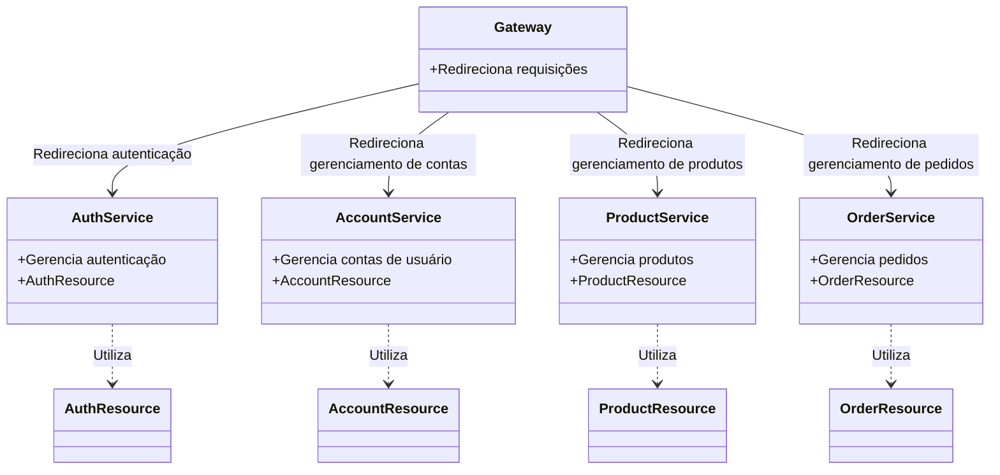
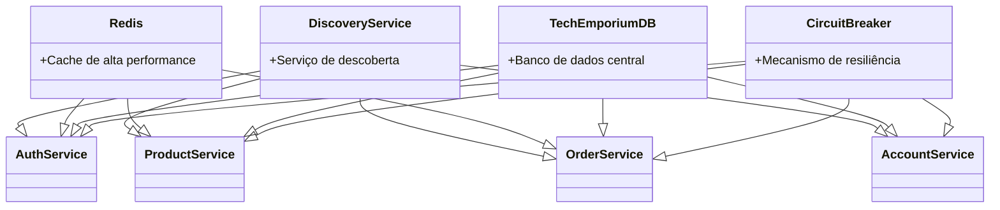

# Tech Emporium
Repositório de Documentação e Referências de microsserviços para o projeto Tech Emporium de Plataformas, APIs e Microsserviços

### Autores:
- [Lucca Hiratsuca Costa](https://github.com/LuccaHiratsuca)
- [Thomas Chiari Ciocchetti de Souza](https://github.com/thomaschiari)

### Descrição Geral:
Tech-Emporium simula uma loja online de produtos de tecnologia, em que usuários podem se autenticar, e usuários autenticados podem cadastrar produtos, alterar produtos, criar orders, alterar orders e deletar orders. 

### Serviços: 

| Service            | Repository Link                                                                                   |
|--------------------|---------------------------------------------------------------------------------------------------|
| Account            | [Account](https://github.com/LuccaHiratsuca/platform.store.account)                               |
| Account Resource   | [Account Resource](https://github.com/LuccaHiratsuca/platform.store.account-resource)             |
| Auth               | [Auth](https://github.com/LuccaHiratsuca/platform.store.auth)                                     |
| Auth Resource      | [Auth Resource](https://github.com/LuccaHiratsuca/platform.store.auth-resource)                   |
| Gateway            | [Gateway](https://github.com/LuccaHiratsuca/platform.store.gateway)                               |
| Discovery          | [Discovery](https://github.com/LuccaHiratsuca/platform.store.discovery)                           |
| Product            | [Product](https://github.com/thomaschiari/platform.tech-emporium.products)                        |
| Product Resource   | [Product Resource](https://github.com/thomaschiari/platform.tech-emporium.product-resource)       |
| Order              | [Order](https://github.com/thomaschiari/platform.tech-emporium.orders)                            |
| Order Resource     | [Order Resource](https://github.com/thomaschiari/platform.tech-emporium.order-resource)           |
| Docker API         | [Docker API](https://github.com/LuccaHiratsuca/platform.store.docker-api)                         |
| Tech Emporium DB   | [Tech Emporium DB](https://github.com/thomaschiari/platform.tech-emporium.db)                     |
| Redis              | [Redis](https://github.com/LuccaHiratsuca/platform.tech-emporium.redis)                           |
| Paypal             | [Paypal](https://github.com/LuccaHiratsuca/platform.tech-emporium.paypal)                         |
| Paypal Resource    | [Paypal Resource](https://github.com/LuccaHiratsuca/platform.tech-emporium.paypal-resource)       |
| Frontend           | [Frontend](https://github.com/LuccaHiratsuca/platform.tech-emporium.frontend)                     |

### Diagrama de funcionamento de serviços:

### Diagrama de funcionamento de Infraestrutura:

### Apresentação do Projeto:
- [Apresentação](https://www.canva.com/design/DAGGGQxQAOk/whNCVZho9MY3qcaYNA9QvQ/edit?utm_content=DAGGGQxQAOk&utm_campaign=designshare&utm_medium=link2&utm_source=sharebutton)
