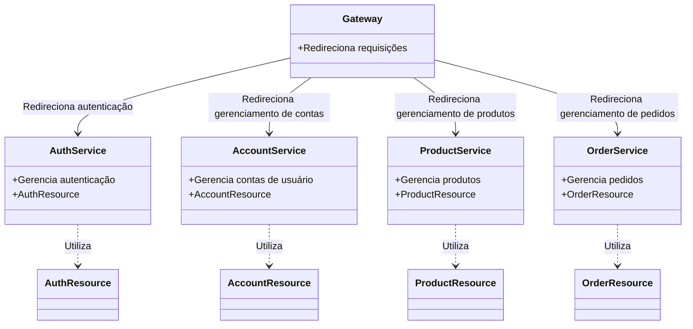
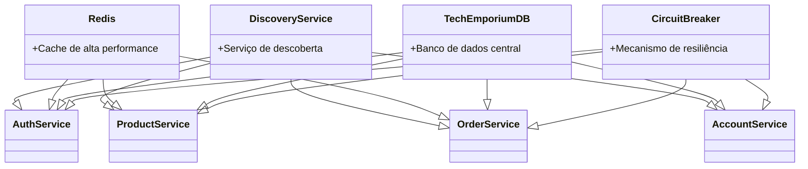

# Tech Emporium
Repositório de Documentação e Referências de microsserviços para o projeto Tech Emporium de Plataformas, APIs e Microsserviços

### Alunos:
- [Lucca Hiratsuca Costa](https://github.com/LuccaHiratsuca)
- [Thomas Chiari Ciocchetti de Souza](https://github.com/thomaschiari)

### Descrição Geral:
Tech-Emporium simula uma loja online de produtos de tecnologia, em que usuários podem se autenticar, e usuários autenticados podem cadastrar produtos, alterar produtos, criar orders, alterar orders e deletar orders. 

### Serviços: 
- Account

Link para repositório: [Account](https://github.com/LuccaHiratsuca/platform.store.account)

- Account Resource

Link para repositório: [Account Resource](https://github.com/LuccaHiratsuca/platform.store.account-resource)

- Auth

Link para repositório: [Auth](https://github.com/LuccaHiratsuca/platform.store.auth)

- Auth Resource

Link para repositório: [Auth Resource](https://github.com/LuccaHiratsuca/platform.store.auth-resource)

- Gateway

Link para repositório: [Gateway](https://github.com/LuccaHiratsuca/platform.store.gateway)

- Discovery

Link para repositório: [Discovery](https://github.com/LuccaHiratsuca/platform.store.discovery)

- Product

Link para repositório: [Product](https://github.com/thomaschiari/platform.tech-emporium.products)

- Product Resource

Link para repositório: [Product Resource](https://github.com/thomaschiari/platform.tech-emporium.product-resource)

- Order

Link para repositório: [Order](https://github.com/thomaschiari/platform.tech-emporium.orders)

- Order Resource

Link para repositório: [Order Resource](https://github.com/thomaschiari/platform.tech-emporium.order-resource)

- Docker API

Link para repositório: [Docker API](https://github.com/LuccaHiratsuca/platform.store.docker-api)

- Tech Emporium DB

Link para repositório: [Tech Emporium DB](https://github.com/thomaschiari/platform.tech-emporium.db)

- Redis

Link para repositório: [Redis](https://github.com/LuccaHiratsuca/platform.tech-emporium.redis)

### Diagrama de funcionamento de serviços:

### Diagrama de funcionamento de Infraestrutura:

### Apresentação do Projeto:
- [Apresentação](Tech%20Emporium.pdf)