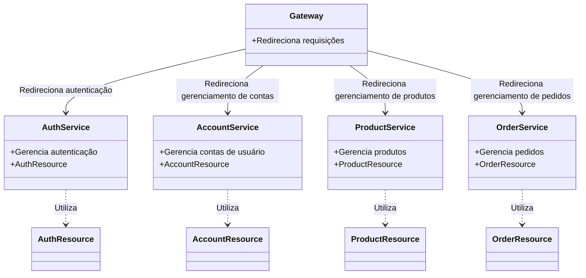
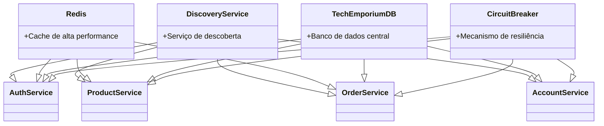

# Structure

## Diagrama de Funcionamento de Serviços

Aqui está descrito como é o funcionamento de nossa aplicação, com os serviços e suas interações.

Os nossos serviços são interligados e se comunicam entre si para fornecer uma experiência completa ao usuário. O Gateway é responsável por redirecionar as requisições para os serviços apropriados, enquanto os serviços de autenticação, contas, produtos e pedidos gerenciam as operações específicas de cada área. O serviço de pagamentos, implementado posteriormente, também é integrado ao sistema para permitir transações seguras e eficientes.

## Diagrama de Funcionamento de Infraestrutura

A infraestrutura do Tech Emporium é composta por diversos componentes que garantem o funcionamento adequado dos serviços. O Redis é utilizado como cache de alta performance em todo o sistema, enquanto o Discovery Service é responsável por localizar os microsserviços. O Tech Emporium DB é o banco de dados central que armazena todas as informações persistentes, e o Circuit Breaker garante a resiliência dos serviços em caso de falhas, utilizando a biblioteca Resilience4j.

